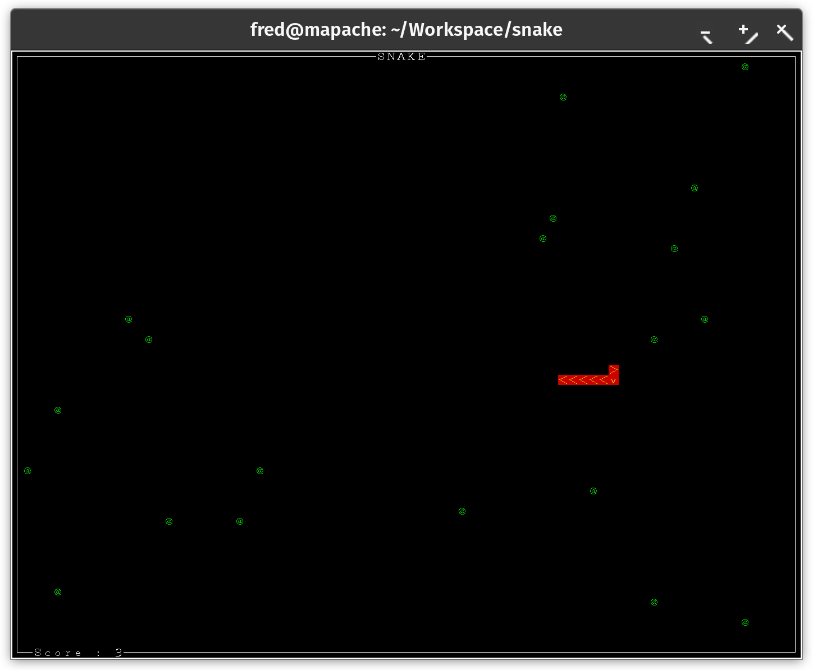

snake
=====

Full featured Python snake game. Supports Py2k and Py3k. **This is abandonware. I write it on holiday in Bogotá, Colombia, in 2012. Please do not PR it, fork it if interested in doing that.**



I recommend that you use a square font. On my system, the optimal font definition to use is `-*-fixed-*-r-*-ko-18-*-*-*-c-*-iso10646-*` and is provided by the file `/usr/share/fonts/X11/misc/18x18ko.pcf.gz`. So I run the xterm that will be launching snake with:

```
xterm -fn -*-fixed-*-r-*-ko-18-*-*-*-c-*-iso10646-* -bg black -fg white
```

To see font definitions on your system, look at the file `fonts.dir` in your X11 font directory or use the `xfontsel` program.

As the font is public domain, a copy is also in this directory.

For a full list of options, type `./snake.py -h`.

`snake` supports maps. To use the example map, type `./snake.py map.smp`. The provided `rendermap_image.py` script generates maps from images using PIL. 
